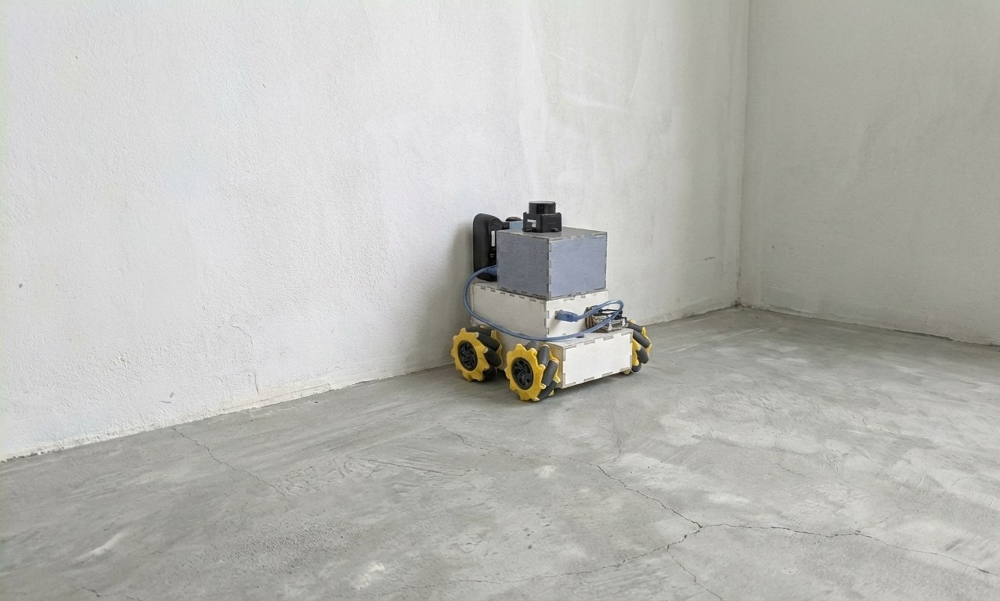
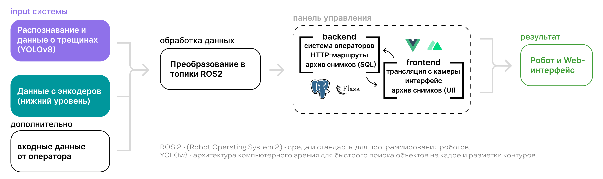

# SmartSurface

**Мобильный робот для исследования стен и автоматизации отделочных работ**

## Идея

SmartSurface вырос из простой задачи: облегчить работу со стенами, которую обычно выполняют вручную. Робот должен перемещаться вдоль поверхности, собирать данные и помогать оператору находить дефекты. Следующий шаг - связать обследование стены с её обработкой.

В основе проекта - мобильная платформа с четырьмя всенаправленными колёсами, Raspberry Pi 5, Arduino Mega, лидар и камера. Оператор управляет роботом через браузер и видит видео и данные датчиков в одной панели.

## Возможности и состояние проекта

В технических материалах описаны ручное управление через веб-панель, обратная связь от четырёх энкодеров, колёсная одометрия с EKF, сканы лидара и видеопоток камеры. Для обнаружения трещин предусмотрена сегментация YOLOv8-seg; Hailo рассматривается как вариант ускорения.

Базовая архитектура использует одометрию. Полноценные SLAM и Nav2 относятся к расширению навигации. В материалах также описаны экспериментальные сценарии поиска стены, сканирования и работы инструментом.

**Сейчас в открытой части проекта собраны документация и изображения.** Исходники, прошивка и воспроизводимая инструкция сборки ещё не опубликованы. Описание основано на предоставленных технических материалах; измеренные FPS, точность и производительность отделки пока не приведены.

## Как всё связано

Браузер отправляет команды веб-узлу, тот публикует их в ROS 2. Мост передаёт команды Arduino, а контроллер управляет моторами и возвращает данные энкодеров. Камера и лидар независимо поставляют данные для панели и экспериментальных сценариев.

Схема показывает концепцию из презентации. Подробное описание текущего графа узлов и различий между одометрией и SLAM находится в [документе по архитектуре](docs/ARCHITECTURE.md).

## Программная часть

- **ROS 2 и Python** - узлы, сообщения датчиков, управление и связь с контроллером.
- **Nuxt 4, Vue 3 и Tailwind CSS** - интерфейс оператора.
- **Flask и Socket.IO** - HTTP API, телеметрия и обмен с панелью.
- **MJPEG и OpenCV** - передача и обработка видеопотока.
- **robot_localization** - фильтрация одометрии.
- **YOLOv8-seg** - экспериментальное обнаружение трещин.
- **PostgreSQL** - авторизация в описанной конфигурации веб-узла.

## Документация

Начните с [архитектуры](docs/ARCHITECTURE.md), затем выберите нужный раздел:

- [ROS 2 и веб API](docs/ROS_AND_WEB_API.md) - топики, сервисы, HTTP, Socket.IO и видео.
- [Arduino и одометрия](docs/ARDUINO_PROTOCOL.md) - Serial-протокол, оси, энкодеры и управление.
- [Компьютерное зрение](docs/COMPUTER_VISION.md) - обработка кадров, CPU и Hailo, оценка качества.
- [Конфигурация и эксплуатация](docs/OPERATIONS.md) - параметры, диагностика и требования к воспроизводимой сборке.

